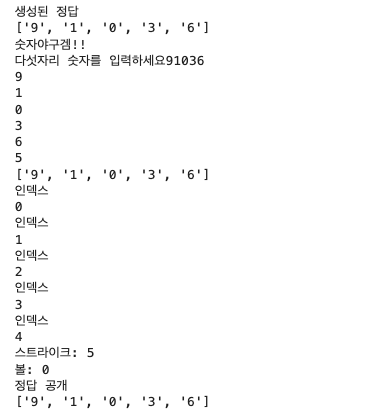
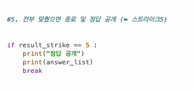
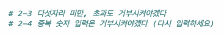
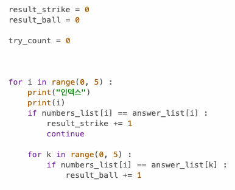

# AIFFEL Campus Online Code Peer Review Templete
- 코더 : 정범준
- 리뷰어 : 차병곤

# PRT(Peer Review Template)
- [X]   **1. 주어진 문제를 해결하는 완성된 코드가 제출되었나요?**
    	- 퀘스트 조건이었던 부분을 잘 만들어주셨습니다.
	- 다만, 사소한 차이지만 출력 양식이 조건에서는 (예: 1 strike 2 ball)과 같은데, 조금 다른 방식으로 구현해주셨습니다.
        - 시간이 조금 더 주워졌다면, 사용자에게 출력하는 부분이 리팩토링 되면 좋을 거 같습니다.
        - 

    
- [X]   **2. 전체 코드에서 가장 핵심적이거나 가장 복잡하고 이해하기 어려운 부분에 작성된 
주석 또는 doc string을 보고 해당 코드가 잘 이해되었나요?**
    - 코드가 이해하기 어려울 만큼 복잡하지는 않았고, 최대한 간단하게 기능을 구현하려고 노력하신 부분이 보였습니다.
    - 흥미로웠던 점은 미션의 조건에는 작성되어있지는 않았지만, 5스트라이크가 될 때까지 기회를 주고, 5스트라이크가 되었을 때 기능을 종료했다는 점입니다.
    - 

        
- [X]   **3. 에러가 난 부분을 디버깅하여 문제를 해결한 기록을 남겼거나
    - 구현하고 싶었던 부분을 주석으로 작성해주셨는데, 완성은 못하셨습니다.
    - 그렇지만 기능 구현 전에 먼저 주석으로 플로우를 작성하셨다는 점이 인상깊었습니다.
    - 또한, 우선순위가 높은 부분을 먼저 구현하고 시간이 없을 시에 저렇게 주석처리 되어 있는 부분을 다음 번에 개발할 수 있게 관리할 수 있을 거 같아서 그부분도 인상깊었습니다.
    - 

        
- [X]   **4. 회고를 잘 작성했나요?**
    - 회고 내용은 발표를 통해 전달해주셨습니다.
    - 함께 진행한 동료분과 코드 이해수준을 맞춰가며 진행했다는 점이 인상깊었습니다.
    - 그러기 위해서 주석으로 전체 플로우에 대해 싱크를 맞추고,  그 이후로 한줄씩 구현해나간 점이 인상깊었습니다.

        
- [X]   **5. 코드가 간결하고 효율적인가요?**
    - 4번의 들여쓰기 가이드를 잘 준수하고 있습니다.
    - 변수명 설정을 camel_case로 설정하여 가이드를 잘 준수하고 있습니다.
    - 
